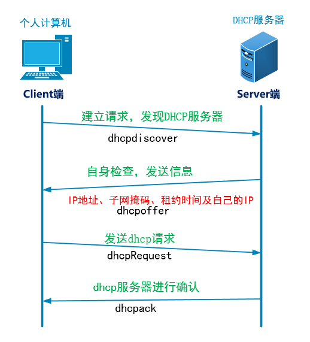

# 任务背景

运维负责的工作不仅只有服务器， 公司内部的相关IＴ支持也需要懂得（很多时候 不见得运维要亲自去做，但是必 须懂）。目前公司所有员工加一起共30多人 ，每个人都有自己的办公电脑，再加上手机等设备基本上总设备在80- 100左右。设备的大量增多需要公司的内网划分出明确的内网网段， 之后 IP地址的分配肯定不能手动设定，这就要 用到DHCP 来动态分配IP地址。于是乎运维需要架设DHCP服务器（DHCP大多多直接使用网络设备分发，现在也有 使用Linux服务架设DHCP服务，然后分网段分发再结合交换机    ）

**任务要求**

搭建一台DHCP服务器，给办公人员提供自动分配**172.16.0.0/24**网段的IP地址

# 课程目标

 能够搭建简单的DHCP服务器 了解DHCP工作原理

**涉及知识点**

DHCP服务的配置（新知识点）

**具体实施**

 

1. ```
   1. 环境准备
   
   将vmware软件的host-only网络模式下的DHCP功能关闭
   
   1. 将jumper-server和app1客户端的网络模式设置为相同（仅主机模式）
   
   1. jumper-server的仅主机模式的网卡的IP必须是要给客户端分配的网段 改变后的网络信息如下：
   
   eth1: <BROADCAST,MULTICAST,UP,LOWER_UP> mtu 1500 qdisc pfifo_fast state UP qlen 1000 
   
   ​     link/ether 00:0c:29:23:5e:72 brd ff:ff:ff:ff:ff:ff
   
   ​     inet 172.16.0.250/24 brd 172.16.0.255 scope global 
   
   ​     eth1 inet6 fe80::20c:29ff:fe23:5e72/64 scope link
   
   ​         valid_lft forever preferred_lft forever
   
   1. 搭建dhcp服务
   
    安装软件：
   
   [root@jumper-server ~]# yum -y install dhcp
   
   修改配置文件：
   
   vim /etc/dhcp/dhcpd.conf
   
   option domain-name "itcast.cc";
   
   option domain-name-servers 172.16.0.254, 8.8.8.8;
   
   default-lease-time 3600;
   
   max-lease-time 7200; 
   
   log-facility local7;
   
    
   
   subnet 172.16.0.0 netmask 255.255.255.0 {
   
   ​    range 172.16.0.100 172.16.0.200;
   
   ​    option routers 172.16.0.254;
   
   ​    option broadcast-address 172.16.0.255;}
   
    
   解说：
   vim /etc/dhcp/dhcpd.conf
   
   option domain-name "itcast.cc";            //域名
   
   option domain-name-servers 192.168.1.110, 8.8.8.8; //DNS(可以写多个)
   
   default-lease-time 3600;       //缺省租约
   
   max-lease-time 7200;           //客户端最大租约
   
   log-facility local7;           //定义日志设备载体    （/var/log/boot.log输出）
   
    
   
   subnet 172.16.0.0 netmask 255.255.255.0 {     //子网<网段>
   
   range 172.16.0.100 172.16.0.200;              //地址范围<地址池> 
   
   option routers 172.16.0.254;                  //网关
   
   option broadcast-address 172.16.0.255         //广播地址
   
   }
   
    
   
   启动服务：
   
   [root@jumper-server ~]# /etc/init.d/dhcpd start
   
   Starting dhcpd:                                                        [  OK ]
   
   [root@jumper-server ~]# netstat -nulp|grep dhcpd
   
   udp        0      0 0.0.0.0:67                  0.0.0.0:*
   
   1767/dhcpd
   
    
   
    
   
   测试验证： 在app1服务器上修改IP地址的获取方式为dhcp，然后重启网络，查看IP 
   
   [root@app1-server network-scripts]# ip a
   
   1: lo: <LOOPBACK,UP,LOWER_UP> mtu 16436 qdisc noqueue state UNKNOWN link/loopback 00:00:00:00:00:00 brd 00:00:00:00:00:00
   
   inet 127.0.0.1/8 scope host lo inet6 ::1/128 scope host
   
   valid_lft forever preferred_lft forever
   
   2: eth0: <BROADCAST,MULTICAST,UP,LOWER_UP> mtu 1500 qdisc pfifo_fast state UP qlen 1000 
   
   ​    link/ether 00:0c:29:6b:b2:d9 brd ff:ff:ff:ff:ff:ff
   
   ​    inet 172.16.0.100/24 brd 172.16.0.255 scope global eth0 inet6 fe80::20c:29ff:fe6b:b2d9/64 scope link
   
   ​        valid_lft forever preferred_lft forever
   ```

   

 

# 知识储备

## 1.  DHCP介绍

 

DHCP（Dynamic Host Configuration Protocol，动态主机配置协议）是一个**局域网**的网络协议，UDP协 议，67号端口

主要用于**动态管理分配IP地址**

## 2.  DHCP工作原理




 

**过程分析：**

​    dhcpdiscover（发现）：该过程中客户端开始建立请求，以0.0.0.0作为自己的ip地址而以 255.255.255.255（广播地址）作为服务器的地址，等待DHCP服务器响应。

​    dhcpoffer（提供）：当网络中的dhcp服务器收到dhcpdiscover信息后，对自身进行检查，并发送相应的地 址。服务器发送给请求客户机的信息中主要包含了ip地址、子网掩码、租约和提供dhcp服务的服务器的ip。 

​    dhcprequset（请求）：当dhcp客户收到服务器的返回信息后，就以广播的方式发送一个dhcp请求信息给本 网络中的存在或不存在的其他的dhcp服务器，该信息中包含了已选择的dhcp服务器的ip地址。

​    dhcpack（确认）：一旦被选中的dhcp收到客户端的请求信息后，就将以保留的这个ip标识为以租用，然后 广播的方式发送一个dhcpack信息给dhcp客户端，当客户端收到了确认信息后就完成了整个的获取ip的过 程。

