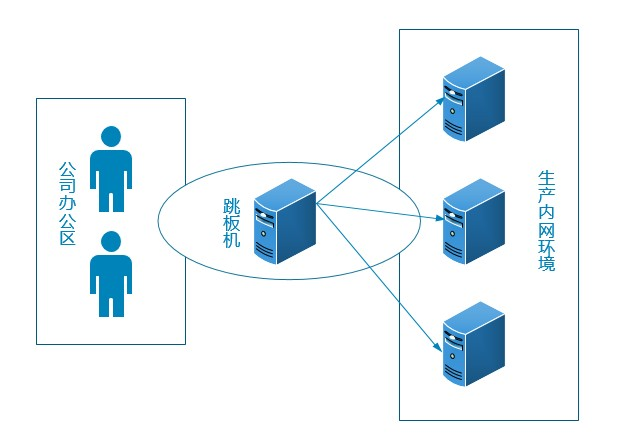
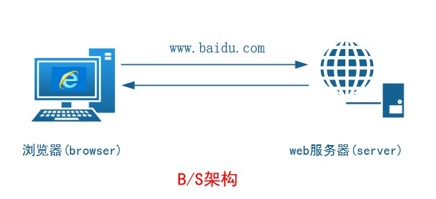
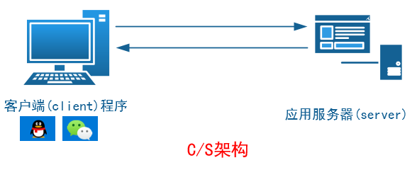

# 任务背景

为了最大程度的保护公司内网服务器的安全，公司内部有一台服务器做跳板机。运维人员在维护过程中首先要统一 登录到这台服务器，然后再登录到目标设备进行维护和操作。由于开发人员有时候需要通过跳板机登录到线上生产 环境查看一些业务日志，所以现在需要运维人员针对不同的人员和需求对账号密码进行统一管理，并且遵循**权限最 小化**原则。

 



**任务要求**

1. 跳板机上为每个开发人员创建一个账号，并且只能在指定的目录里管理自己的文件，不能删除别人的文件。

（跳板机完成）

2. 线上生产服务器，禁止使用root用户远程登录。（生产服务器完成）
3. 线上生产服务器sshd服务不允许使用默认端口，防止黑客进入端口扫描。（生产服务器完成）

4. 线上生产服务器的业务用户的密码使用工具随机生成。（生产服务器完成）

5. 开发人员可以使用业务用户**pos1**登录线上环境来查看日志（/pos/logs/xxx）

**课程目标**

 能够根据需求搭建ssh服务 掌握sshd服务客户端工具的使用

**涉及知识点**

用户权限管理（旧知识点）

ssh服务配置（新知识点）

生成随机密码工具（新知识点）

**具体实施**

**1.** **创建用户并给相应权限**

 

```
创建用户：code1~code3

[root@jumper-server ~]# useradd code1 

[root@jumper-server ~]# useradd code2 

[root@jumper-server ~]# useradd code3

 

[root@jumper-server ~]# id code1

uid=500(code1) gid=500(code1) groups=500(code1) 

[root@jumper-server ~]# id code2

uid=501(code2) gid=501(code2) groups=501(code2)

[root@jumper-server ~]# id code3

uid=502(code3) gid=502(code3) groups=502(code3)

 

使用非交互式设置密码：

[root@jumper-server ~]# echo 123|passwd --stdin code2 

Changing password for user code2.

passwd: all authentication tokens updated successfully. 

[root@jumper-server ~]# echo 123|passwd --stdin code3 

Changing password for user code3.

passwd: all authentication tokens updated successfully.

 

创建相应的目录给开发人员使用：

[root@jumper-server ~]# mkdir /data/code -p 

[root@jumper-server ~]# ll -d /data/code/

drwxr-xr-x 2 root root 4096 Aug 26 09:39 /data/code/

 

创建code组并且将code1~code3成员加入其中： 

[root@jumper-server ~]# groupadd code 

[root@jumper-server ~]# usermod -G code code1 

[root@jumper-server tmp]# gpasswd -a code2 code 

Adding user code2 to group code

[root@jumper-server tmp]# id code2

uid=501(code2) gid=501(code2) groups=501(code2),503(code) 

[root@jumper-server tmp]# gpasswd -a code3 code

[root@jumper-server tmp]# id code2

uid=501(code2) gid=501(code2) groups=501(code2),503(code)

[root@jumper-server tmp]# tail /etc/group

...

code:x:503:code1,code2,code3

 

更改目录权限：

[root@jumper-server ~]# ll -d /data/code/

drwxr-xr-x 2 root root 4096 Aug 26 09:39 /data/code/ 

[root@jumper-server ~]# chgrp code /data/code/

[root@jumper-server ~]# ll -d /data/code/

drwxr-xr-x 2 root code 4096 Aug 26 09:39 /data/code/ 

[root@jumper-server ~]# chmod g+w /data/code/

[root@jumper-server ~]# ll -d /data/code/

drwxrwxr-x 2 root code 4096 Aug 26 09:39 /data/code/

 

权限最小化：

[root@jumper-server code]# chmod o+t /data/code/ 

[root@jumper-server code]# ll -d /data/code/ 

drwxrwxr-t 2 root code 4096 Aug 26 10:44 /data/code/ 

[root@jumper-server code]# su - code1

[code1@jumper-server ~]$ cd /data/code/ 

[code1@jumper-server code]$ ll

total 0

-rw-rw-r-- 1 code1 code1 0 Aug 26 10:43 file1

-rw-rw-r-- 1 code2 code2 0 Aug 26 10:44 file2 

[code1@jumper-server code]$ rm -f file2

rm: cannot remove `file2': Operation not permitted 
```

 

**2.**  **线上环境禁止root远程登录**

**客户端工具：**

ssh客户端工具使用：

  

```
ssh --help 

man ssh

 

[user@]hostname [command]

 

[root@jumper-server ~]# ssh 10.1.1.1 
root@10.1.1.1's password:

[code1@jumper-server ~]$ ssh [pos1@10.1.1.1](mailto:pos1@10.1.1.1) 

pos1@10.1.1.1's password:

 

注意： 当前本机用户是root，如果不指定连接用户，那么会让你输入远程主机的root密码。

如果指定了连接用户pos1，那么不管你当前是什么用户就只让你输入远程主机的pos1用户密码。

 

[code1@jumper-server ~]$ ssh -l pos1 -p 22 10.1.1.1 

pos1@10.1.1.1's password:

-l：指定连接用户

-p：指定端口

 

[root@jumper-server ~]# ssh 10.1.1.1 hostname 

root@10.1.1.1's password:

app1-server 

[root@jumper-server ~]#
```


 

scp命令：远程拷贝

 

用法： 

将本地文件拷贝到远程：

scp 需要拷贝的文件  远程服务器

scp file1 pos1@10.1.1.1:/tmp/

将远程文件拷贝到本地： 

scp 远程文件  本地路径 

scp -r pos1@10.1.1.1:/tmp/dir1 /data/code

-r:递归拷贝目录


```
[code1@jumper-server code]$ scp file1 pos1@10.1.1.1:/tmp 

pos1@10.1.1.1's password: 

file1                             100%    0     0.0KB/s   00:00    

[code1@jumper-server code]$ ll 

total 0 

-rw-rw-r-- 1 code1 code1 0 Aug 26 10:43 file1 

-rw-rw-r-- 1 code2 code2 0 Aug 26 10:44 file2 

[code1@jumper-server code]$ scp 10.1.1.1:/tmp/aaa . 

code1@10.1.1.1's password: 

[code1@jumper-server code]$ scp pos1@10.1.1.1:/tmp/aaa . 

pos1@10.1.1.1's password: 

scp: /tmp/aaa: not a regular file 

[code1@jumper-server code]$ scp -r pos1@10.1.1.1:/tmp/aaa . 

pos1@10.1.1.1's password: hosts       100%  158     0.2KB/s   00:00   

[code1@jumper-server code]$ ll 

total 4 

drwxr-xr-x 2 code1 code1 4096 Aug 26 11:45 aaa 

-rw-rw-r-- 1 code1 code1    0 Aug 26 10:43 file1 

-rw-rw-r-- 1 code2 code2    0 Aug 26 10:44 file2
```


 

 

**sshd服务：**

 

```
[root@app1-server ~]# rpm -qf /usr/sbin/sshd 

openssh-server-5.3p1-94.el6.x86_64 

[root@app1-server ~]# rpm -ql openssh-server 

/etc/rc.d/init.d/sshd      启动脚本 

/etc/ssh/sshd_config       配置文件 

/usr/sbin/sshd             程序本身（二进制的命令）


禁止root远程登录：

思路： 1. 通过修改配置文件完成 2. 通过查看man文档来找答案

步骤：

 [root@app1-server ~]# vim /etc/ssh/sshd_config 

...

#PermitRootLogin yes 

PermitRootLogin no

 ...

[root@app1-server ~]# /etc/init.d/sshd restart 

Stopping sshd:                                             [  OK  ] 

Starting sshd:                                             [  OK  ]

测试验证：

 [root@jumper-server ~]# ssh root@10.1.1.1 

root@10.1.1.1's password: Permission denied, please try again.

root@10.1.1.1's password: Permission denied, please try again. 

root@10.1.1.1's password: Permission denied (publickey,gssapi-keyex,gssapi-with-mic,password).

说明：不能使用root直接登录，但是可以使用其他用户登录成功后切换到root。 

[root@jumper-server ~]# ssh pos1@10.1.1.1 

pos1@10.1.1.1's password: 

Last login: Sun Aug 26 11:50:05 2018 from 10.1.1.250 


[pos1@app1-server ~]$ su - root 

Password:
```

 

 


 

**3.**  **线上环境sshd服务不能使用默认端口**

 

```
将默认的22号端口更改为10022 

思路： 

1. 查看在当前服务器中10022是否被使用 

   netstat -a|grep 10022 

   ss -a|grep 10022 

   lsof -i 10022 

   grep 10022 /etc/services

1. 修改配置文件 

   [root@app1-server ~]# vim /etc/ssh/sshd_config 

   #Port 22 

   Port 10022

​       [root@app1-server ~]# service sshd restart 

​        Stopping sshd:                                         [  OK  ] 

​        Starting sshd:                                         [  OK  ]

1. 测试验证 

   [root@jumper-server ~]# ssh -lpos1 10.1.1.1 

   ssh: connect to host 10.1.1.1 port 22: Connection refused 

   [root@jumper-server ~]# ssh -lpos1 10.1.1.1 -p10022 

   pos1@10.1.1.1's password: 

   Last login: Sun Aug 26 15:08:20 2018 from 10.1.1.250

   说明： 

   如果更改了端口，那么远程连接时必须指定端口号。

   补充： 

   更改客户端配置文件，不想验证指纹： 

   #StrictHostKeyChecking ask   

   StrictHostKeyChecking yes     表示直接比对~/.ssh/known_hosts文件中的公钥   

   

   问题： [root@jumper-server ~]# ssh stu3@10.1.1.1 

   No RSA host key is known for 10.1.1.1 and you have requested strict checking. Host key verification failed. 原因： 我将known_hosts文件删掉了，所以无法比对公钥，直接拒绝连接。

   解决： StrictHostKeyChecking no


```

 


 

**4.** **线上业务用户密码随机生成**

 


```
环境： 当前服务器不能上外网，需要安装pwgen软件本地光盘里没有。 
解决： jumper-server可以访问互联网，那么配置一个epel源，直接下载并安装pwgen工具 
注意： 修改/etc/yum.conf文件文件 keepcache=1    修改0为1，表示缓存下载的软件包到本地。
 
epel源： 
[root@jumper-server yum.repos.d]# cat epel.repo 
[epel] 
name=xxx 
baseurl=http://mirrors.aliyun.com/epel/6/x86_64/ 
enabled=1 
gpgcheck=0

# yum -y install pwgen 找到下载的软件包： 
[root@jumper-server yum.repos.d]# ls /var/cache/yum/x86_64/6/epel/packages/ pwgen-2.08-1.el6.x86_64.rpm
 
拷贝该软件到生产服务器： 
# scp /var/cache/yum/x86_64/6/epel/packages/pwgen-2.08-1.el6.x86_64.rpm 10.1.1.1:/tmp
 
再次安装使用即可
 
# pwgen --help 
Usage: pwgen [ OPTIONS ] [ pw_length ] [ num_pw ]

参数： 
-c or –capitalize 
密码中至少包含一个大写字母 
-A or –no-capitalize 
密码中不包含大写字母 
-n or –numerals 
密码中至少包含一个数字 
-0 or –no-numerals 
密码中不包含数字 
-y or –symbols 
密码中至少包含一个特殊符号 
-s or –secure 
生成完全随机密码 
-B or –ambiguous 
密码中不包含模糊字符（如1,l,O,0） 
-C 在列中打印生成的密码 
-1 不要在列中打印生成的密码，即一行一个密码
 
#pwgen -cnBs1 10 3 
生成长度为10，包含大写、数字、不包含模糊字符完全随机的3个密码
```

 

 

**5.**  **开发人员使用pos1用户登录查看日志**

 

```
1. 创建日志目录 
mkdir /logs/app1 
2. pos1业务用应该可以再该目录里创建文件 
[root@app1-server ~]# ll -d /logs/app1/
drwxr-xr-x 2 root root 4096 Aug 26 16:49 /logs/app1/
 
[root@app1-server ~]# chown pos1 /logs/app1 
[root@app1-server ~]# ll -d /logs/app1/ 
drwxr-xr-x 2 pos1 root 4096 Aug 26 16:49 /logs/app1/
 
思考：会有什么风险？ 解决： 创建另外一个pos用户，只给它在/logs/app1目录上查看权限就可以 useradd pos
```

 

 

**扩展总结**

**一、什么是服务**

• 运行在操作系统后台的一个或者多个程序，为系统或者用户提供特定的服务 • 可靠的，并发的，连续的不间断的 运行，随时接受请求  • 通过交互式提供服务

**二、服务器架构**

• B/S(browser/server) 浏览器/服务器 概念：这种结构用户界面是完全通过浏览器来实现，使用http协议 优势：节 约开发成本

 

 

 

• C/S（client/server）客户端/服务器 概念：指的是客户端和服务端之间的通信方式，客户端提供用户请求接口， 服务端响应请求进行对应的处理，并返回给客户端    优势：安全性较高，一般面向具体的应用

 


**两者区别：**

**B/S：**

1、广域网，只需要有浏览器即可 2、一般面向整个互联网用户，安全性低 3、维护升级简单

**C/S：** 

1、专用网络、小型局域网，需要具体安装对应的软件 2、一般面向固定用户，安全性较高 

思考1:

我们通过网络是如何找到我们想要访问的服务的? 

**IP(提供服务的服务器)+Port(找到相应的服务)**


 

**三、端口号设定**

说明:端口号只有整数，范围是从0 到65535•  1～255：

一般是知名端口号，如:

ftp  21号、

web  80、

ssh 22、

telnet23号

256～1023：通常都是由Unix系统占用来提供特定的服务   •   1024~5000：客户端的临时端口，随机产生 •

大于5000：为互联网上的其他服务预留


 

思考**2:**

如何查看系统默认的注册端口?

cat /etc/serivces

 

**四、常见的网络服务**

文件共享服务：FTP、SMB、NFS、HTTP 

域名管理服务：DNS

 网站服务：Apache、Nginx、Lighttpd、IIS 

邮件服务: Mail

远程管理服务：SSH、telnet 

动态地址管理服务:DHCP

**五、ssh服务概述**

**1. SSH介绍**

SSH是Linux下远程管理的工具，相比Telnet安全，运维人员必备的神器

SSH的全称Secure Shell，安全的shell，是Client/Server架构，默认端口号为22，TCP/IP协议

SSH其实用于商业，而OpenSSH即为开源的，在Linux中默认安装 

SSH有v1和v2版本

​    ssh v1：有漏洞，容易受到攻击

​     ssh v2：通过公钥加密（数字签名和密钥交换）的方式进行，确保服务器端的身份识别

**2. SSH加密算法**

des      对称的公钥加密算法,安全低，数据传输速度快；使用同一个秘钥进行加密或解密

rsa    非对称的公钥加密算法,安全,数据传输速度慢 ，SSH默认的加密算法

**3. SSH认证方式**

基于用户密码的认证

基于秘钥对的认证（免密码登录）