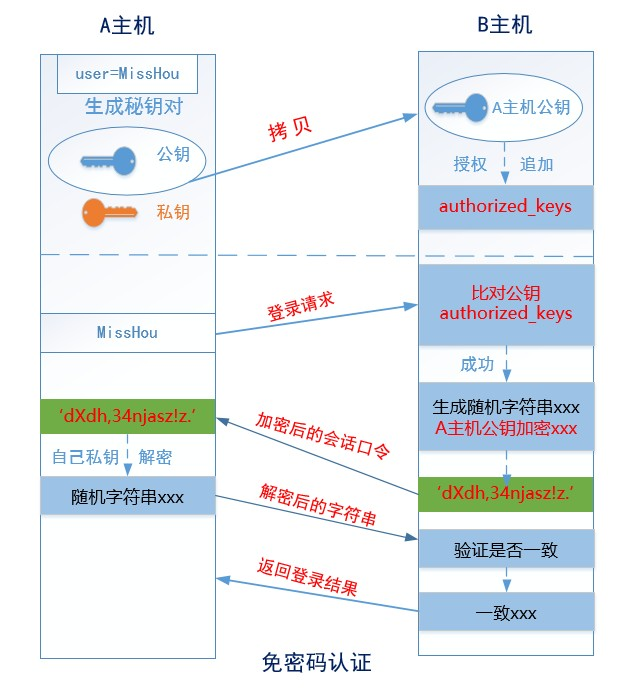
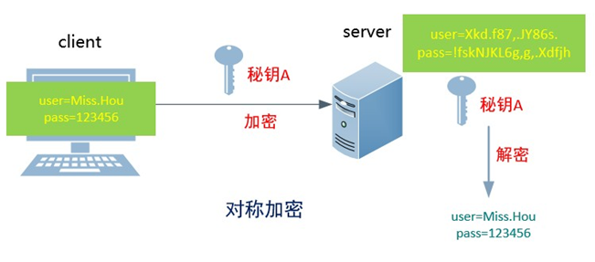
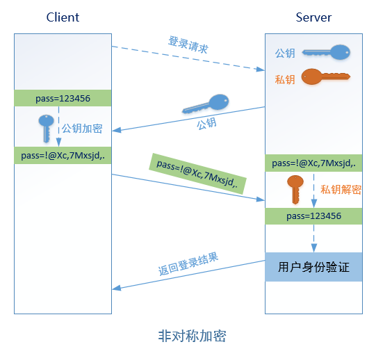
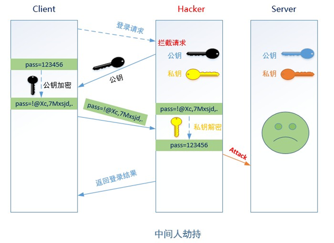

### 任务背景

经过一段时间后，开发人员和运维人员都觉得使用密码SSH登录的方式太麻烦（每次登录都需要输入密码，难记又容易泄露密码）。为了安全和便利性方面考虑，要求运维人员给所有服务器实现免密码登录。

### 任务要求

所有开发人员通过远程业务用户pos登录生产服务器实现免密码登录。

### 涉及知识点

- 用户生成秘钥对（公钥和私钥）
- 免密码登录配置

### 具体实施

**理解免密码登录原理：**




**详细步骤：**

~~~powershell
1. 确保线上app1服务器上有pos用户
[root@app1-server ~]# id pos
uid=504(pos) gid=504(pos) groups=504(pos)
[root@app1-server ~]# echo 123|passwd --stdin pos

2. 跳板机上的开发人员code1~code3分别生成一对秘钥
[code1@jumper-server .ssh]$ ssh-keygen 
Generating public/private rsa key pair.
Enter file in which to save the key (/home/code1/.ssh/id_rsa): 
Enter passphrase (empty for no passphrase): 
Enter same passphrase again: 
Your identification has been saved in /home/code1/.ssh/id_rsa.
Your public key has been saved in /home/code1/.ssh/id_rsa.pub.
The key fingerprint is:
21:10:21:06:0b:d0:13:e9:52:7b:89:fc:82:cb:f4:ba code1@jumper-server
The key's randomart image is:
+--[ RSA 2048]----+
|=o+o+o           |
|.o=. .           |
|.+ + .. .        |
|. = o  . .       |
| o o    S        |
|... .            |
|o...             |
|.. .             |
| Eo              |
+-----------------+
[code1@jumper-server .ssh]$ ll
total 12
-rw------- 1 code1 code1 1675 Aug 28 09:37 id_rsa		私钥
-rw-r--r-- 1 code1 code1  401 Aug 28 09:37 id_rsa.pub	公钥
-rw-r--r-- 1 code1 code1  390 Aug 26 11:27 known_hosts

3. 跳板机上的code1~code3人员将自己的公钥远程拷贝到线上app1的pos用户的家目录里（~/.ssh/xxx）
[code1@jumper-server .ssh]$ ssh-copy-id -i pos@10.1.1.1
pos@10.1.1.1's password: 
Now try logging into the machine, with "ssh 'pos@10.1.1.1'", and check in:

  .ssh/authorized_keys

to make sure we haven't added extra keys that you weren't expecting.
或者
[code1@jumper-server .ssh]$ scp id_rsa.pub pos@10.1.1.1:/home/pos/.ssh/authorized_keys
pos@10.1.1.1's password: 
id_rsa.pub                                                                             100%  401     0.4KB/s   00:00    
[code1@jumper-server .ssh]$ 

4. 测试验证
[code1@jumper-server ~]$ ssh pos@10.1.1.1
[pos@app1-server ~]$ 

~~~

**课堂练习：**

A主机上的运维用户需以B主机的root用户和test用户实现免密码登录

A:运维生成一对**密钥对**，将公钥远程分别拷贝到B主机的**root**用户和**test**用户的家目录里

B:root和test

 

ssh root@B 

ssh test@B

**扩展总结**


 

**图解SSH加密算法**

 

des      对称的公钥加密算法,安全低，数据传输速度快；使用同一个秘钥进行加密或解密

rsa   非对称的公钥加密算法,安全,数据传输速度慢 ，SSH默认的加密算法

 

 


 

**1**

思考 ：

用户信息加密了，但如何安全的保存密钥呢？




 

1、远程Server收到Client端用户的登录请求后，Server端把自己的公钥发给用户 2、Client端使用这个公钥，将密 码进行加密 3、Client将加密的密码发送给Server端 4、远程Server用自己的私钥，解密登录密码，然后验证其合 法性 5、根据验证结果，给Client相应的响应。

2思考 ：

非对称加密就绝对安全吗？




 

**问题：** **SSH****中是如何解决这个问题的呢？**

基于用户密码的认证


```
[root@MissHou ~]# ssh 192.168.10.171

`The authenticity of host '192.168.10.171 (192.168.10.171)' can't be established. RSA key fingerprint is 9f:71​:de:​3c:86:25:dd:f0:06:78​:ab:​ba:96:5a:e4:95.`

`Are you sure you want to continue connecting (yes/no)?`
提示信息：**无法确认主机192.168.10.171的真实性，指纹是
9f:71​:de:​3c:86:25:dd:f0:06:78​:ab:​ba:96:5a:e4:95. ，你确定想要继续吗？
```


**说明**：

1. 理论上应该是对公钥的确认，由于公钥通过RSA算法加密，太长，不好直接比较，所以给公钥生成一个hash 的指纹，方便比较。

2. 当客户端输入yes确认对方的公钥指纹后，server端的公钥就会被存放到客户机的用户家目录里

~/.ssh/known_hosts文件中，下次再访问就直接通过密码登录，不需要再确认公钥。

   基于秘钥对的认证（免密码登录）

   3.SSH

虽然有著名的DH密钥交换算法，但SSH**原理上**不能抵御中间人攻击。然而实际上，SSH使用TOFU安全模型等同于做到了防中间人攻击。SSH的首次连接会下载服务端的公钥，用户确认后公钥将被保存并信任。下次访问时客户端将会核对服务端发来的公钥和本地保存的是否相同，不同就发出中间人攻击的警告拒绝连接，除非用户手动清除已保存的公钥。所以，**如果首次连接没有中间人，之后的连接就无需担心中间人**，因为中间人给出的公钥和服务端给出的公钥相同的可能性可以忽略。如果首次连接就有中间人攻击，那么恭喜你中奖了。

TOFU模型类似于使用Firefox浏览器访问自签https证书的网站，首次访问会提示风险，让用户确认亦或选择离开。如果用户确认了并添加网站证书到信任列表，之后的访问都不会再提示，连接也会被标识为安全的。


 

**相关文件解读：**

1. id_rsa：保存私钥

2. id_rsa.pub：保存公钥

3. authorized_keys：保存已授权的客户端公钥 

4. known_hosts：保存已认证的远程主机公钥